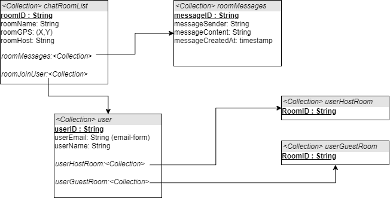
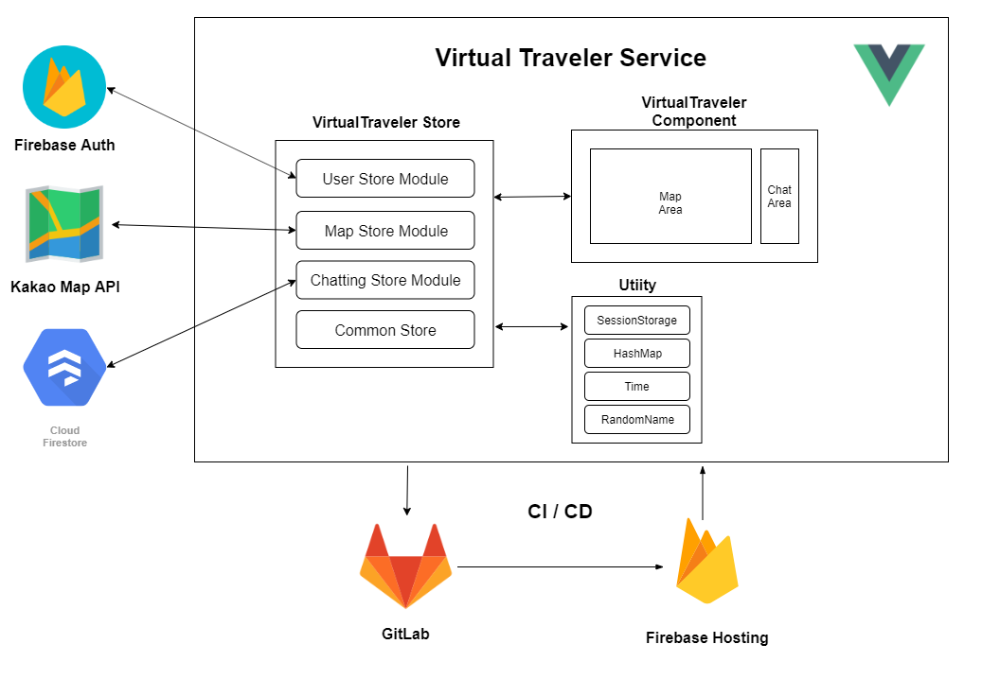

# VirtualTraveler

#### 지도 API 기반 가상 여행 서비스

다수의 사람들이 인스턴트 형식으로 참여하여 함께 로드뷰 여행을 즐기는 서비스

## 팀

- 조우현 : Projact Manager
  - `CI/CD`, `UI`, `firebase authentication`
- 곽빛나라 : Map part Developer
  - `Kakao map`, `chat room & map connector`
- 채윤병 : Map part Developer
  - `Kakao roadview`, `chat room & roadview connector`
- 최승미 : Chat part Developer
  - `Firebase Firestore Database design & implement`, `chat room design`
- 강민 : Chat part Developer
  - `Firebase Firestore Database design`, `random nickname`

## 아키텍쳐

- <a href="./deliverables/mockup.md">UI Mockup</a>

- <a href="./deliverables/function_specification.md">Function Specification</a>

  

- Data Structure

  

- Service Architecture

  

## 일정	

### <a href="https://calendar.google.com/calendar/embed?src=k4h8g6b7jn7vrmqlngfj93lb7s%40group.calendar.google.com&ctz=Asia%2FSeoul">Google Team Calendar</a>

## WIKI

- 문서 작성 & 코딩 컨벤션
  
  - <a href="./wiki/about_markdown.md">마크다운 기본 문법</a>
  
    
  
- 개발환경
  
  - CI / CD
  
    - <a href="./wiki/cicd.md">CI / CD 개념정리</a>
    - <a href="./wiki/gitlab-ci.md">GitLab CI/CD 도입하기</a>
  
  - <a href="./wiki/about_vscode.md">VScode 팁 모음</a>
  
  - <a href="./wiki/ESlint.md">ESlint</a>
  
    
  
- Chatting

  - <a href=" https://cionman.tistory.com/50 ">Firebase Realtime database chatting app</a>
    - <a href="./wiki/about_realtime_database_chat.md">분석</a>
  - <a href=" https://www.youtube.com/watch?v=ifOzAyR1cG4 ">Firebase Firestore chatting app</a>
    - <a href="./wiki/about_firebase.md">분석</a>

  

- Vue
  
  - <a href=" https://joshua1988.github.io/web-development/vuejs/vue-structure/ ">실무에서 사용하는 Vue.js 프로젝트 구조</a>
  - <a href="https://joshua1988.github.io/web-development/vuejs/boost-productivity/">Vue.js 개발 생산성을 높여주는 도구 3가지</a>
  - <a href=" https://programmingsummaries.tistory.com/385 ">pakage.json에 대하여</a>
  - <a href="./wiki/vuex-vue.md">Vuex에 대하여</a>
  - <a href="./wiki/es6-for-vue.md">Vue.js에 필요한 es6 문법</a>
  - <a href="./wiki/lifecycle-vue.md">Lifecycle에 대하여</a>
  
  
  
- JavaScript

  - <a href="./wiki/about_promise_async_await.md">비동기 개념 정리(Promise, Async/Await)</a>
  - <a href="./wiki/javascript-modularization.md">ES6 Import & Export</a>
  - <a href="./wiki/var_let_const.md">JavaScript의 변수선언(var, let, const)</a>
  - <a href="./wiki/this.md">상황에 따른 this</a>
  - <a href="./wiki/about_callback_function.md">Javascript의 callback 개념</a>

  

- API
  
  - <a href="./wiki/about_rest.md">REST API 개념정리</a>
  - <a href="./wiki/about_roadview.md">Kakao Roadview</a>
  
    

- Server

  - <a href="https://tansfil.tistory.com/58?category=255594">Session/Cookie, JWT 인증 방식</a>
  - <a href="https://tansfil.tistory.com/59?category=255594">Access Token + Refresh Token 인증 방식</a>
  - <a href="https://tansfil.tistory.com/60?category=255594">SNS 로그인, OAuth</a>
  - <a href="./wiki/about_firebase_auth.md">Firebase Auth</a>

## 회의록

- 2019.10.15 - <a href="./meeting-log/20191015.md">기능정의 / 개발환경 / UI 회의</a>
- 2019.10.21 - <a href="./meeting-log/20191021.md">리소스 회의</a>
- 2019.10.22 - <a href="./meeting-log/20191022.md">스프린트 회의</a>
- 2019.10.23 - <a href="./meeting-log/20191023.md">DB 회의</a>