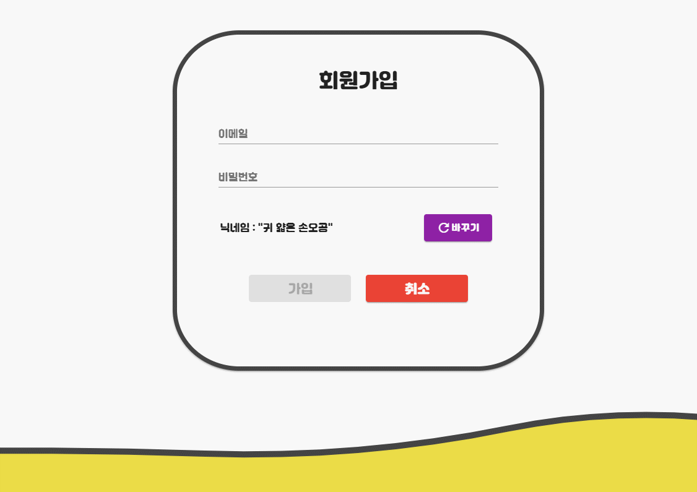
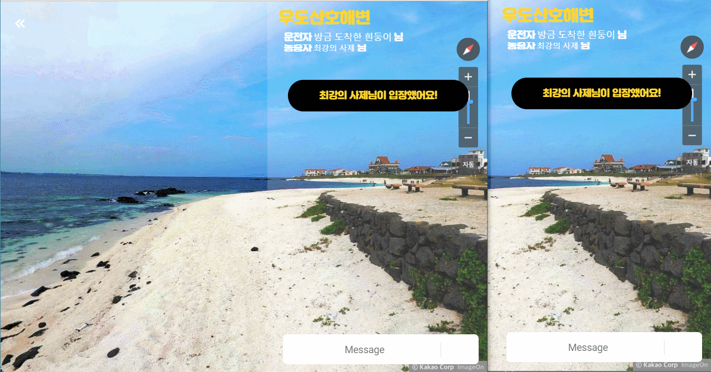
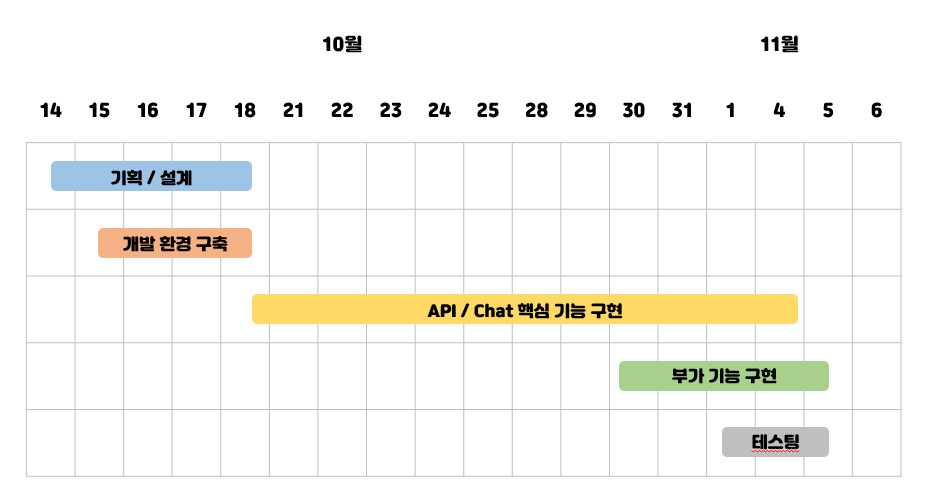
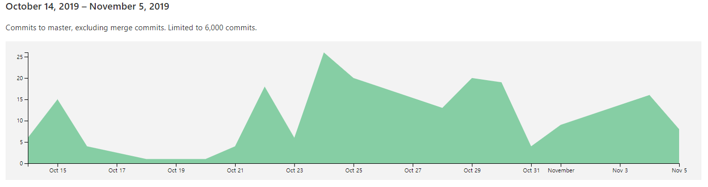
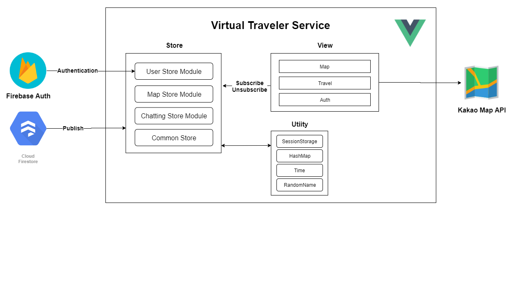
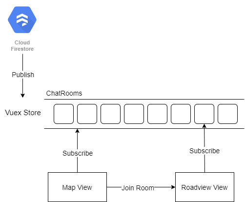
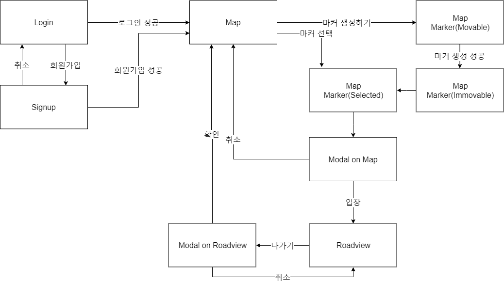

## 🌎 웹으로 여행하자!

- ### 일상에 지친 당신!

- ### 여행갈 형편이 되지않는 당신!

- ### 심심한 당신!

  ### 바로 당신을 위한 가상 여행 서비스 '방구석 여행'

  

##  💡 주요 기능

- ### 랜덤 닉네임

  

- ### 실시간 마커 이동

  

- ### 실시간 공유 로드뷰

  

- ### 채팅

  

## 라이센스

 ### This is released under the MIT license. See [LICENSE](./LICENSE) for details. 

## 프로젝트에 관하여

> 삼성 청년 소프트웨어 아카데미 1기 / 2학기 심화프로젝트 18조

## 🙌 팀

- #### 조우현 : Project Manager

  - `CI/CD`, `UI`, `Firebase Authentication`

- #### 곽빛나라 : Map part Developer

  - `Kakao map`, `chat room & map connector`

- #### 채윤병 : Map part Developer

  - `Kakao roadview`, `chat room & roadview connector`

- #### 최승미 : Chat part Developer

  - `Firestore Database design & implement`, `chat room design`

- #### 강민 : Chat part Developer

  - `Firestore Database design & implement`, `random nickname`

## 📆 프로젝트 일정

## 💡 브랜치 전략

- CI / CD를 활용한 빌드 테스팅 / 배포 자동화

  - Git Branch 전략

    - `Master Branch` 

      배포용 브랜치로 해당 브랜치로 merge되면 자동으로 배포된다.

    - `Develop Branch` 

      개발중 가장 최신화된 버전의 소스

    - `Feature Branch`

      기능 개발시 `Develop Branch`로 부터 생성, 개발 완료후 `Develop Branch`로 merge

      

  - Commit Chart

    

    

  - Pipeline Chart

    

## 🧱 프로젝트 아키텍쳐

- Service Architecture 

- Service Flow
  

## 📚 문제해결 및 도움되는 문서

- **문서 작성**

  - <a href="./wiki/about_markdown.md">마크다운 기본 문법</a>

    

- **개발환경**

  - CI / CD
    - <a href="./wiki/cicd.md">CI / CD 개념정리</a>
    - <a href="./wiki/gitlab-ci.md">GitLab CI/CD 도입하기</a>
  - <a href="./wiki/about_vscode.md">VScode 팁 모음</a>
  - <a href="./wiki/ESlint.md">ESlint</a>
  - <a href="./wiki/about_MVVMpattern.md">MVVM패턴</a>

    

- **Chatting**

  - <a href=" https://cionman.tistory.com/50 ">Firebase Realtime database chatting app</a>
    - <a href="./wiki/about_realtime_database_chat.md">분석</a>
  - <a href=" https://www.youtube.com/watch?v=ifOzAyR1cG4 ">Firebase Firestore chatting app</a>
    - <a href="./wiki/about_firebase.md">분석</a>

  

- **Vue**

  - <a href=" https://joshua1988.github.io/web-development/vuejs/vue-structure/ ">실무에서 사용하는 Vue.js 프로젝트 구조</a>
  - <a href="https://joshua1988.github.io/web-development/vuejs/boost-productivity/">Vue.js 개발 생산성을 높여주는 도구 3가지</a>
  - <a href=" https://programmingsummaries.tistory.com/385 ">pakage.json에 대하여</a>
  - <a href="./wiki/vuex-vue.md">Vuex에 대하여</a>
  - <a href="./wiki/es6-for-vue.md">Vue.js에 필요한 es6 문법</a>
  - <a href="./wiki/lifecycle-vue.md">Lifecycle에 대하여</a>

  

- **JavaScript**

  - <a href="./wiki/about_promise_async_await.md">비동기 개념 정리(Promise, Async/Await)</a>
  - <a href="./wiki/javascript-modularization.md">ES6 Import & Export</a>
  - <a href="./wiki/var_let_const.md">JavaScript의 변수선언(var, let, const)</a>
  - <a href="./wiki/this.md">상황에 따른 this</a>
  - <a href="./wiki/about_callback_function.md">Javascript의 callback 개념</a>
  - <a href="./wiki/exception_handling.md">예외 처리</a>
  - <a href="./wiki/JSON.md">JSON</a>

  

- **API**

  - <a href="./wiki/about_rest.md">REST API 개념정리</a>
  - <a href="./wiki/about_roadview.md">Kakao Roadview</a>

    

- **Server**

  - <a href="https://tansfil.tistory.com/58?category=255594">Session/Cookie, JWT 인증 방식</a>
  - <a href="https://tansfil.tistory.com/59?category=255594">Access Token + Refresh Token 인증 방식</a>
  - <a href="https://tansfil.tistory.com/60?category=255594">SNS 로그인, OAuth</a>
  - <a href="./wiki/about_firebase_auth.md">Firebase Auth</a>

## 🤘 회의록

- <a href="./meeting-log/20191015.md">2019년 10월 15일</a>
- <a href="./meeting-log/20191016.md">2019년 10월 16일</a>
- <a href="./meeting-log/20191021.md">2019년 10월 21일</a>
- <a href="./meeting-log/20191022.md">2019년 10월 22일</a>
- <a href="./meeting-log/20191023.md">2019년 10월 23일</a>
- <a href="./meeting-log/20191025.md">2019년 10월 25일</a>
- <a href="./meeting-log/20191029.md">2019년 10월 29일</a>
- <a href="./meeting-log/20191031.md">2019년 10월 31일</a>
- <a href="./meeting-log/20191101.md">2019년 11월 01일</a>
- <a href="./meeting-log/20191105.md">2019년 11월 05일</a>

