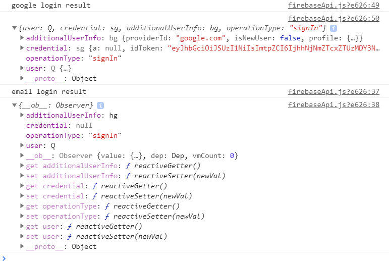

# Firebase Auth & User Session

> 2019-10-29 (작성자: 강민)


### preview

- Firebase Login 과정에서 Google Login과 Email Login을 제공하고 있다. 이 두 방식으로 로그인한후 return값을 살펴보니 차이점이 존재한다. 바로 credential의 유무이다. credential이 무엇인지, 왜 그러한 것인지, 차이점이 무엇인지 알아보자.

  


### credential

- 우선 credential이란 정보 시스템의 특정 운용에서 사옹하는 암호학적인 개인 정보를 뜻한다고는 한다. firebase에서 적용한다면, credential엔 개인정보가 담긴 토큰이 들어있다는 이야기이다.

- 근데 위 그림에서 보면, Google Login에는 credential이 들어있는 방면에 Email Login에는 credential이 null이다. 그렇다면, Google Login에는 로그인 토큰이 존재하고 그냥 Email Login에는 로그인 토큰이 존재하지 않는 것일까?

- 위 질문에 답은 **''NO''** 라고 생각한다. Google이나 Email이나 다른 방법으로 로그인이 되었다. 즉, 로그인에 대한 세션은 두 방법 다 유지되어 있다는 것이다.

- 그리고 Credential에 대한 정보를 찾아본 결과, firebase reference 문서에 이러한 문구가 적혀져 있다.

  >  *Interface that represents the credentials returned by an **auth provider**.* 

  이는 <a href="https://firebase.google.com/docs/reference/js/firebase.auth.AuthCredential.html?hl=ko">firebase.auth.AuthCredential</a>에 대한 설명으로, 위 그림의 credential 항목에 AuthCredential이란 형태를 표시한 것이다. 즉 auth provider에 의해 반환된 Credential 객체로 담겨져 있는 것이다. Google Login은 Google Provider를 이용하여 credential 정보를 제공하고 있지만, Email Login은 provider가 없기 때문에 credential 항목에 null이 된 것이었다.

- 그럼 Google Login에 대한 로그인 정보는 확인할 수는 있다. 근데 Email Login의 로그인 정보는 어떻게 확인 할 수 있는 것일까?


### firebase Auth

- 파이어베이스를 이용한 로그인, 회원가입, 로그아웃 등 인증과정을 거치는 인터페이스는 firebase.auth 이다.

- 파이어베이스 인증의 작동원리는 다음과 같다

  1. 로그인시 사용자에게 인증 정보를 받는다. **이때 인증 정보는이메일주소와 비밀번호일 수도 있고, Google이나 Facebook과 같은 제휴 인증업체에서 받은 OAuth 토큰일 수도 있다.**
  2. 받은 인증 정보를 firebase 인증 SDK로 전달된다.
  3. Firebase 백앤드 서비스가 정보를 확인하여 클라이언트에 응답을 반환한다.

- 여기서 주목해야할 점은 인증정보가 방법에 따라 다른 것이다. 그렇기 때문에 앞서 credential항목에서도 Google Login과 Email Login의 차이가 생기는 것이었다.

- 그리고 인증시 다루는 토큰으로는 3가지 유형이 존재한다

  | Firebase ID 토큰       | 사용자가 앱에 로그인할 때 Firebase가 만드는 토큰입니다. 이 토큰은 서명된 JWT로, Firebase 프로젝트에서 사용자의 신원을 안전하게 식별합니다. 이 토큰은 Firebase 프로젝트에 고유한 사용자의 ID 문자열을 비롯하여, 사용자의 기본 프로필 정보를 담고 있습니다. [ID 토큰의 무결성은 검증이 가능하므로](https://firebase.google.com/docs/auth/admin/verify-id-tokens) 이 토큰을 백엔드 서버로 전송하여 현재 로그인한 사용자의 신원을 식별할 수 있습니다. |
  | ---------------------- | ------------------------------------------------------------ |
  | **ID 제공업체 토큰**   | **Google과 Facebook 등의 제휴 ID 제공업체가 생성하는 토큰입니다. 토큰의 형식은 다양하지만 대개는 OAuth 2.0 액세스 토큰입니다. 앱은 이 토큰을 통해 사용자가 ID 공급업체에서 정상적으로 인증을 거쳤음을 확인하고, 토큰을 Firebase 서비스가 사용할 수 있는 사용자 인증 정보로 변환합니다.** |
  | **Firebase 맞춤 토큰** | **사용자가 자체 인증 시스템을 통해 앱에 로그인할 수 있게 해 주는 맞춤 인증 시스템이 만드는 토큰입니다. 맞춤 토큰은 [서비스 계정의 비공개 키를 사용해 서명한](https://firebase.google.com/docs/auth/admin/create-custom-tokens) JWT입니다. 앱은 제휴 ID 공급업체에서 반환한 토큰을 사용할 때와 유사한 방식으로 이 토큰을 사용합니다.** |


### firebase user

- '*우리가 왜 firebase auth를 자세히 살펴볼까?*' 란 의문을 갖는 배경은 단순히 로그인, 회원가입, 로그아웃이 아니라, **현재 user를 확인하고 이를 어떻게 지속되는가**에서 출발하고 있다. 이러한 배경을 가지고 조사한 결과 firebase로 인증하는 방식에 따라 받는 정보가 다르다는 것을 알았고, 이제는 받은 정보를 어떻게 활용될 것이가에 대해 이야기한다.

- 우선은 받은 인증 정보, 즉 현재 사용자는 로그인 할때와 가입한 직후 현재 사용자가 되는 것이다.

- 이 현재 사용자를 확인하는 기능도 firebase.auth에 담겨져 있다. 크게 두가지 방법이 있다.

  1. **Auth개체에 리스너를 설정하기 (권장)**

     ```javascript
     firebase.auth().onAuthStateChanged(function(user) {
       if (user) {
         // User is signed in.
       } else {
         // No user is signed in.
       }
     });
     ```

  2. **currentUser속성을 이용하기**

     ```javascript
     let user = firebase.auth().currentUser;
     
     if (user) {
       // User is signed in.
     } else {
       // No user is signed in.
     }
     ```

- 현재 사용자에 대한 정보는 읽을 수는 있으나, 이를 언제까지 읽을 수 있는가에 대한 대답으로는 세션 관리 분분에 속해있다. **기본적으로 웹 어플리케이션 경우, firebase auth는 사용자가 브라우저를 닫은 후에도 세션을 유지**하고 있다. 이 방식은 웹페이지 방문할 대마다 매번 로그인하지 않아도 되는 간편한 방식이기는 하지만, 웹 페이지 사용에 대한 시나리오는 이것 말고도 다양한 상황이 존재한다.

- <a href="https://firebase.google.com/docs/auth/web/auth-state-persistence">아래의 시나리오</a>는 firebase.auth의 기본 세션 유지값이 적합하지 않는 케이스들이다.

  - 민감한 데이터가 있는 애플리케이션은 창이나 탭을 닫을 때마다 상태를 삭제하는 것이 좋다. 사용자가 로그아웃하는 것을 잊은 경우를 대비해서 필요.
  - 여러 사용자가 공유하는 기기에서 사용되는 애플리케이션에는 적합하지 않다. 일반적인 예로는 도서관 컴퓨터에서 실행한 앱같은 경우.
  - 여러 사용자가 액세스할 수 있는 공유 기기의 애플리케이션에도 적합하지 않다. 개발자가 이 애플리케이션의 액세스 방식을 알 수 없으며 사용자에게 세션 유지 여부를 선택할 수 있는 기능을 제공하고자 할 수도 있다. 로그인 과정에 '계정정보 기억' 옵션을 추가하면 이 기능을 제공할 수 있다.
  - 경우에 따라 사용자가 익명이 아닌 계정(제휴, 비밀번호, 전화번호 등)으로 업그레이드할 때까지 개발자가 익명 사용자를 유지하지 않으려고 할 수 있다.
  - 개발자가 여러 탭에서 서로 다른 사용자가 애플리케이션에 로그인할 수 있도록 허용하고자 할 수 있다. 기본 동작은 출처가 동일한 여러 탭에서 상태를 유지하는 것.

- 이러한 시나리오 때문에 인증 상태를 지속하는 부분은 재정의해야 하는 상황이 존재한다. 그리고 이를 firebase.auth에서 제공하고 있다. **제공되는 인증 상태 지속 유형**은 3가지 이다.

  | 열거형                                   | 값        | 설명                                                         |
  | ---------------------------------------- | --------- | ------------------------------------------------------------ |
  | `firebase.auth.Auth.Persistence.LOCAL`   | 'local'   | 브라우저 창이 닫히거나 React Native에서 활동이 폐기된 경우에도 상태가 유지됨을 나타냅니다. 이 상태를 삭제하려면 명시적으로 로그아웃해야 합니다. Firebase 인증 웹 세션은 단일 호스트 출처이며 단일 도메인의 경우에만 유지된다는 점에 유의하세요. |
  | `firebase.auth.Auth.Persistence.SESSION` | 'session' | 현재의 세션이나 탭에서만 상태가 유지되며 사용자가 인증된 탭이나 창이 닫히면 삭제됨을 나타냅니다. 웹 앱에만 적용됩니다. |
  | `firebase.auth.Auth.Persistence.NONE`    | 'none'    | 상태가 메모리에만 저장되며 창이나 활동이 새로고침되면 삭제됨을 나타냅니다. |

- 그리고 위의 값과 ` firebase.auth().setPersistence ` 메소드를 이용하여 인증 상태 지속 유형을 변경할 수 있다.

  ```javascript
  firebase.auth().setPersistence(firebase.auth.Auth.Persistence.SESSION)
    .then(function() {
      // Existing and future Auth states are now persisted in the current
      // session only. Closing the window would clear any existing state even
      // if a user forgets to sign out.
      // ...
      // New sign-in will be persisted with session persistence.
      return firebase.auth().signInWithEmailAndPassword(email, password);
    })
    .catch(function(error) {
      // Handle Errors here.
      var errorCode = error.code;
      var errorMessage = error.message;
    });
  ```

  

### 문서 정리하면서 내린 결론...?

- 로그인 방식마다 인증 세션 정보도 다르다. 다만, Email Login 토큰 정보를 보는 것은 과제이다...
- firebase.auth의 내용을 바탕으로 로그인, 로그아웃, 회원가입, 그리고 현재 사용자 확인을 할 수 있다.
- 그리고 현재 사용자에 대한 세션도 페이지 특성에 맞게 재조정 할 수 있다.

- 우리가 firebase.auth를 사용하면서 onAuthStateChange란 리스너(매서드)를 통해 회원상태관리를 할 수는 있지만, 추가적으로 여기에 Vue.router와 관련된 개념인 <a href="https://router.vuejs.org/kr/guide/advanced/navigation-guards.html">네비게이션 가드</a>를 사용한다면 현재 외원에 따라 페이지 변경 제어를 유용하게 할 수 있을 것이다. (예를 든다면, 로그인 했을때 다시 로그인 페이지가 안 들어가게 만들기 같은거)