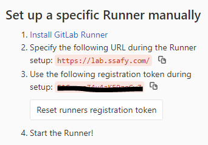
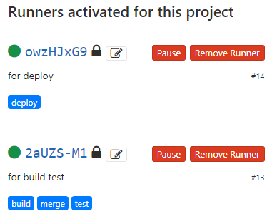
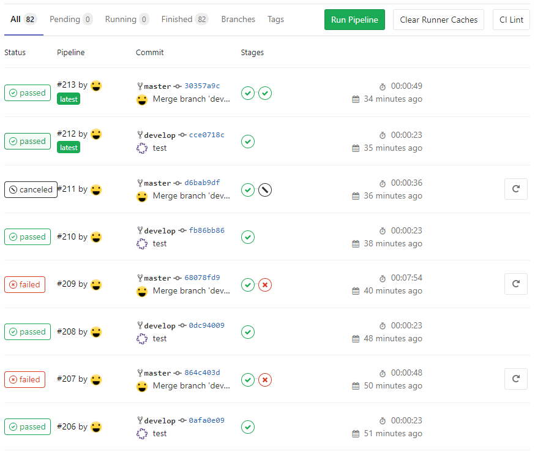
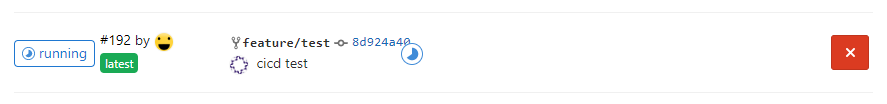
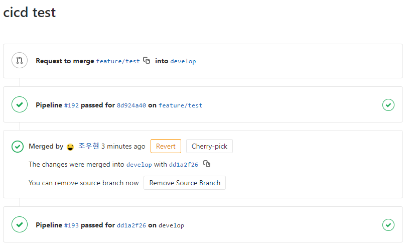
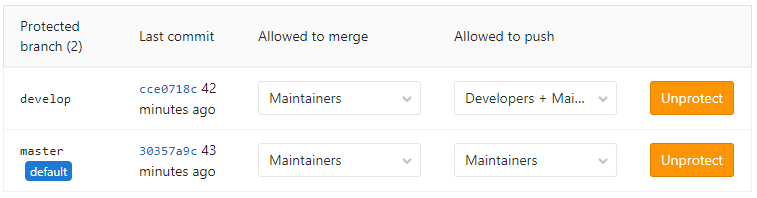
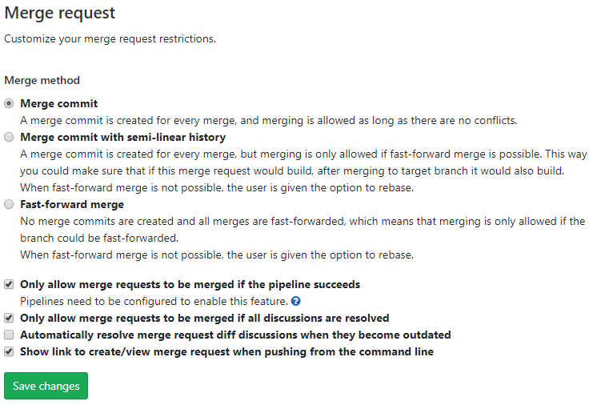

## GitLab CI/CD 사용하기

> Vue.js + Express + AWS EC2 + GitLab CI/CD


- ##### 처음에는 Jenkins를 이용해서 CI/CD를 하고자 했지만, GitLab에서 제공하는 UI를 사용하고 싶어서 GitLab CI/CD를 사용하였습니다.

- ##### Vue.js 프로젝트는 S3를 사용하면 훨씬 더 배포가 쉽기 때문에 단순 Vue.js 프로젝트라면 S3를 추천합니다.


### 1. Vue.js 프로젝트 Express로 EC2에 배포하기

- <a href=" [https://velog.io/@jdm1219/Express-EC2%EC%97%90-%EB%B0%B0%ED%8F%AC%ED%95%B4%EB%B3%B4%EA%B8%B02-cxjxkae7hd](https://velog.io/@jdm1219/Express-EC2에-배포해보기2-cxjxkae7hd) ">참고자료</a>


### 2. GitLab CI/CD 환경 구축

- <a href=" https://docs.gitlab.com/runner/install/linux-manually.html ">GitLab Runner 설치</a>

  파이프라인의 각 Job을 담당할 GitLab Runner를 Ubuntu(EC2)에 설치한다.

  1. 바이너리 설치 파일 다운로드

     ```shell
     # Linux x86-64
     sudo curl -L --output /usr/local/bin/gitlab-runner https://gitlab-runner-downloads.s3.amazonaws.com/latest/binaries/gitlab-runner-linux-amd64
     
     # Linux x86
     sudo curl -L --output /usr/local/bin/gitlab-runner https://gitlab-runner-downloads.s3.amazonaws.com/latest/binaries/gitlab-runner-linux-386
     
     # Linux arm
     sudo curl -L --output /usr/local/bin/gitlab-runner https://gitlab-runner-downloads.s3.amazonaws.com/latest/binaries/gitlab-runner-linux-arm
     ```

  2. 실행 권한 부여

     ```shell
     sudo chmod +x /usr/local/bin/gitlab-runner
     ```

  3. GitLab CI를 위한 User를 생성한다.

     ```shell
     sudo useradd --comment 'GitLab Runner' --create-home gitlab-runner --shell /bin/bash
     ```

  4. 서비스를 설치한다.

     ```shell
     sudo gitlab-runner install --user=gitlab-runner --working-directory=/home/gitlab-runner
     sudo gitlab-runner start
     ```

  

- <a href="https://docs.gitlab.com/runner/register/index.html ">GitLab Runner 등록</a>

  1. 등록 명령어를 입력한다.

     ```shell
     sudo gitlab-runner register
     ```

  2. URL, Token 입력

     

     ```shell
     Please enter the gitlab-ci coordinator URL (e.g. https://gitlab.com )
     https://gitlab.com
     ```

     ```shell
     Please enter the gitlab-ci token for this runner
     xxx
     ```

  3. Runner에 대한 설명 입력

     ```shell
     Please enter the gitlab-ci description for this runner
     [hostname] my-runner
     ```

  4. Runner Tag 입력

     ```shell
     Please enter the gitlab-ci tags for this runner (comma separated):
     my-tag,another-tag
     ```

  5. Runner executor 입력

     ```shell
     Please enter the executor: ssh, docker+machine, docker-ssh+machine, kubernetes, docker, parallels, virtualbox, docker-ssh, shell:
     shell
     ```


- 활성화 된 Runner

  


- `.gilab-ci.yml` 파일 만들기

  runner의 작업에 대한 설정 파일, 프로젝트 디렉토리의 루트에 위치시킨다.

  ```yml
  # 배포 작업
  deploy-to-server:
  	# stage는 build, test, deploy가 있다.
      stage: deploy
      # only 옵션을 통해 특정 상황에서만 runner를 호출할 수 있다.
      only:
          - master
      # script는 해당 job에서 실행할 명령어 script다.
      script:
          - echo 'DEPLOY RUNNING'
          - cd client
          - npm install --progress=false
          - npm run build
          - cd ../server
          - npm install
      # 해당 job을 담당할 Runner의 Tag
      tags:
          - deploy
          
  # 빌드 테스트 작업
  build-test:
      stage: build
      script:
          - echo 'BUILD TEST RUNNING'
          - cd client
          - npm install --progress=false
          - npm run build
          - whoami
      tags:
          - build
  
  ```

  

- 파이프라인 현황

  

- Push 했을 때 빌드 테스트를 실시한다.

  

- Merge Request 했을 때 빌드 테스트를 통과해야 Merge가 활성화 된다.

  

- 브랜치 보호정책

  

- Merge request 정책

  


### 3. 자동배포에 관하여

- Vue.js 프로젝트는 배포시에 서버를 재부팅할 필요없이 서버가 가동중인 상태에서 배포파일을 교체해주면 된다.
- shell이 닫히더라도 계속해서 프로세스가 가동되어야하기 때문에 `nohup npm run start&` 명령어를 사용한다.